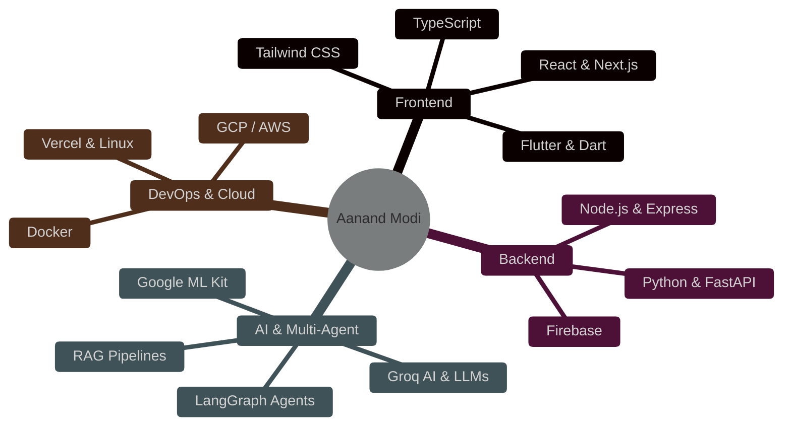

<!-- ✨ Ultra-Aesthetic Neon Dark Mode Profile README ✨ -->

 

  

  
  
  

### 🌌 Who Am I?

<table>
  <tr>
    <td width="55%" valign="top">
      I am a passionate <strong>Computer Engineering student</strong> specializing in <strong>AI/ML & Full-Stack Development</strong>. I don't just study algorithms—I engineer, orchestrate, and deploy autonomous agent networks designed to solve complex real-world challenges. 
        
      🚀 <strong>Core Focus:</strong> Designing multi-agent systems, self-healing code pipelines, and high-performance, responsive full-stack web applications. 
      🌱 <strong>Currently Learning:</strong> Advanced LangGraph, Next.js 14, scalable cloud infrastructure, and vector database clustering. 
      🤝 <strong>Open to Collaborate:</strong> On open-source LLM developer tools, multi-agent frameworks, and high-quality web designs. 
      💬 <strong>Ask me about:</strong> Python, React, FastAPI, multi-agent frameworks, and developer UI/UX aesthetics.  
      <blockquote>
        <i>"Any sufficiently advanced technology is indistinguishable from magic." — Arthur C. Clarke</i>
      </blockquote>
    </td>
    <td width="45%" align="center" valign="middle">
      
    </td>
  </tr>
</table>

  

### 🧠 Developer Mindmap

  

### 🛠️ Languages & Tools

  
  

  

### 🔥 Shipped Projects & Builds

<table>
  <tr>
    <td width="50%" valign="top">
      <h4>🤖 HireMinds AI</h4>
      <strong>Autonomous Hiring Orchestrator</strong> 
      <i>🏆 2nd Runner-Up — CodeVersity, IIT Gandhinagar</i>
      
A fully autonomous 6-agent pipeline managing resume screening, proctored coding environments, adaptive MCQs, and AI voice interviews with zero human intervention.

      <code>Python</code> <code>FastAPI</code> <code>LangGraph</code> <code>React</code> <code>Docker</code>
        
      📊 <strong>Stats:</strong> 6 Orchestrated Agents | 48-Hour Hackathon Build
    </td>
    <td width="50%" valign="top">
      <h4>🚀 StartupOps</h4>
      <strong>AI Co-Founder System</strong> 
      <i>🏆 2nd Runner-Up — GDG Hackathon 2026</i>
      
An autonomous decision engine providing early-stage startups with 24/7 strategic guidance, task prioritization, roadmap generation, and pivot suggestions.

      <code>Python</code> <code>LangGraph</code> <code>React</code> <code>TypeScript</code> <code>Firebase</code>
        
      📊 <strong>Stats:</strong> Multi-Agent Decision Engine | 24-Hour Build
    </td>
  </tr>
  <tr>
    <td width="50%" valign="top">
      <h4>📄 Magnetic Manuscript</h4>
      <strong>AI Academic Formatter</strong> 
      <i>🏁 HACKaMINeD 2026, Nirma University (1250+ Hackers)</i>
      
A 12-agent self-healing formatting pipeline that converts raw research drafts into publication-ready files for IEEE, Nature, and The Lancet formats.

      <code>LangGraph</code> <code>Python-docx</code> <code>FastAPI</code> <code>Citeproc</code>
        
      📊 <strong>Stats:</strong> 12 Specialized Agents | 5 Journal Targets
    </td>
    <td width="50%" valign="top">
      <h4>🍎 Food Insight Scanner</h4>
      <strong>Personalized Nutrition AI</strong> 
      <i>🎯 Showcased at Avishkar 2.0</i>
      
A mobile application using OCR and Groq AI to scan food labels, detect hidden allergens, and generate a personalized health scoring index.

      <code>Flutter</code> <code>Dart</code> <code>Groq AI</code> <code>Google ML Kit</code> <code>Firebase</code>
        
      📊 <strong>Stats:</strong> OCR Analysis Pipeline | Published Research Paper
    </td>
  </tr>
</table>

  

### 🏆 Hackathon Podiums & War Stories

- 🥉 **CodeVersity National Hackathon 2025 (IIT Gandhinagar)** — _2nd Runner-Up_ with **HireMinds AI**
- 🥉 **GDG Autonomous Hackathon 2026 (Google Developer Groups)** — _2nd Runner-Up_ with **StartupOps**
- 🏁 **HACKaMINeD 2026 (Nirma University)** — Competed with **Magnetic Manuscript** among 1250+ hackers
- 🎯 **Avishkar 2.0 (Silver Oak University)** — Featured showcase project with **Food Insight Scanner**
- ⚡ **Smart India Hackathon 2025 (SIH)** — College Top Qualifier representing Silver Oak University

  

### 🔬 Scientific Publications

<blockquote>
  📄 <strong>"Navigating the Nutritional Maze: A Case for the Food Insight Scanner for Personalized Health"</strong> 
  <i>Published in the International Journal of Research and Innovation in Social Science (IJRISS)</i> 
  <strong>Authors:</strong> Aanand Modi, Abhishek Agarwal | <strong>Advisor:</strong> Asst. Prof. K. Ramya 
  <strong>Date:</strong> February 2026 | <strong>ISSN:</strong> 2454-6186 
  🔗 <a href="https://doi.org/10.47772/IJRISS.2026.10190029" target="_blank">Read Paper via DOI Link</a>
    
  <i>"Proposed a personalized OCR mobile translation system to analyze complex nutritional labels, helping address India's food labeling crisis affecting 212 million diabetics. Accepted for publication in 7 days."</i>
</blockquote>

  

### ⚙️ Hack Station Specs

<table>
  <tr>
    <td width="50%">💻 <strong>OS</strong>: Windows 11 Home</td>
    <td width="50%">🐚 <strong>Shell</strong>: PowerShell & Git Bash</td>
  </tr>
  <tr>
    <td>🛠️ <strong>IDE</strong>: VS Code & Cursor</td>
    <td>🎨 <strong>Theme</strong>: Tokyo Night / Synthwave '84</td>
  </tr>
  <tr>
    <td colspan="2">⌨️ <strong>Hardware</strong>: Mechanical Keyboard with Cream Yellow switches</td>
  </tr>
</table>

  

### 📊 Deep Analytics & Live Stats

<table>
  <tr>
    <td width="50%" align="center">
      
    </td>
    <td width="50%" align="center">
      
    </td>
  </tr>
  <tr>
    <td colspan="2" align="center">
      
    </td>
  </tr>
</table>

  

### 🐍 Contribution Grid Snake

  <picture>
    <source media="(prefers-color-scheme: dark)" srcset="https://raw.githubusercontent.com/aanandmodi/aanandmodi/main/assets/github-contribution-grid-snake-dark.svg">
    <source media="(prefers-color-scheme: light)" srcset="https://raw.githubusercontent.com/aanandmodi/aanandmodi/main/assets/github-contribution-grid-snake.svg">
    
  </picture>

 

  

