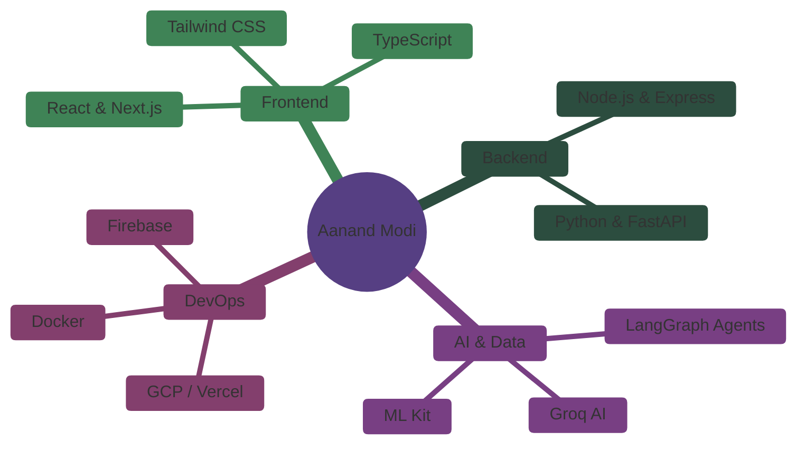

<!-- ✨ Super Aesthetic Lofi & Pixel Art README ✨ -->

<h1>Hi there! I'm Aanand Modi ✦</h1>

  

  

  
  
  
  

### 🌌 Who am I?

<table>
  <tr>
    <td width="55%">
      I am a passionate <strong>Full Stack Developer</strong> and <strong>AI Enthusiast</strong> who loves blending design with technology to build intuitive, engaging, and powerful applications.  
      🔭 <strong>Currently working on:</strong> AI-driven applications like <i>HireMinds AI</i> and autonomous agent networks. 
      🌱 <strong>Currently learning:</strong> Advanced LangGraph, Next.js 14, and Scalable Cloud Infrastructure. 
      🤝 <strong>Looking to collaborate on:</strong> Open-source AI tools and creative web experiences. 
      💬 <strong>Ask me about:</strong> React, Node.js, AI Integration, and UI/UX Design. 
      ⚡ <strong>Fun fact:</strong> I love experimenting with lofi aesthetics, mechanical keyboards, and late-night coding sessions!
        
      <blockquote>
        <i>"Any sufficiently advanced technology is indistinguishable from magic." - Arthur C. Clarke</i>
      </blockquote>
    </td>
    <td width="45%" align="center">
      
    </td>
  </tr>
</table>

  

### 🧠 Developer Mindmap

  

### 🛠️ Languages & Tools

  

  

### 🔥 Featured Projects & Builds

| 🏆 Project | 📜 Description | ⚙️ Tech Stack | 🌟 Achievement |
| :--- | :--- | :--- | :--- |
| **🤖 [HireMinds AI](https://github.com/aanandmodi)** | Autonomous Hiring Orchestrator with 6 AI agents managing resume screening, interviews, and logic. | `Python`, `LangGraph`, `FastAPI`, `React` | 🏆 2nd Runner-Up — CodeVersity, IIT Gandhinagar |
| **🚀 [StartupOps](https://github.com/aanandmodi)** | AI Co-Founder System for real-time strategic guidance, prioritization, and pivots. | `Python`, `LangGraph`, `React`, `Firebase` | 🏆 2nd Runner-Up — GDG Hackathon 2026 |
| **📄 [Magnetic Manuscript](https://github.com/aanandmodi)** | AI Academic Formatter utilizing 12 specialized agents to auto-format IEEE/Nature papers. | `LangGraph`, `Python-docx`, `FastAPI` | 🏁 HACKaMINeD 2026, Nirma University |
| **🍎 [Food Insight Scanner](https://github.com/aanandmodi)** | Personalized Nutrition AI app with OCR to analyze labels and suggest health alternatives. | `Flutter`, `Dart`, `Groq AI`, `ML Kit` | 🎯 Showcased at Avishkar 2.0 |
| **✍️ [Bloggazers](https://github.com/aanandmodi)** | Full-stack blogging platform featuring Google OAuth, nested comments, and robust CRUD. | `React`, `Node.js`, `Firebase`, `Tailwind` | 🌟 My First Major Full-Stack App |

  

### 📊 Deep Analytics & Stats

<table>
  <tr>
    <td width="50%" align="center">
      
    </td>
    <td width="50%" align="center">
      
    </td>
  </tr>
</table>

  

### 🐍 Contribution Grid Snake

  <picture>
    <source media="(prefers-color-scheme: dark)" srcset="https://raw.githubusercontent.com/aanandmodi/aanandmodi/main/assets/github-contribution-grid-snake-dark.svg">
    <source media="(prefers-color-scheme: light)" srcset="https://raw.githubusercontent.com/aanandmodi/aanandmodi/main/assets/github-contribution-grid-snake.svg">
    
  </picture>

  
  
    
  
  
  
  
<i>Building the web, one line of code at a time. Thanks for dropping by! 🎧☕</i>

  
  

