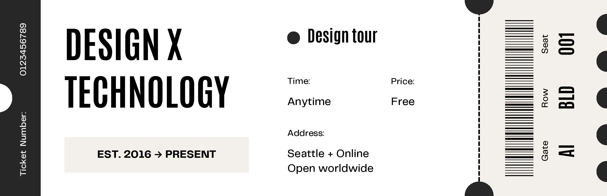
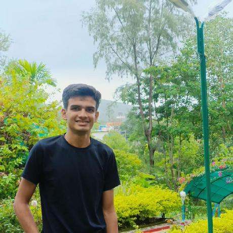
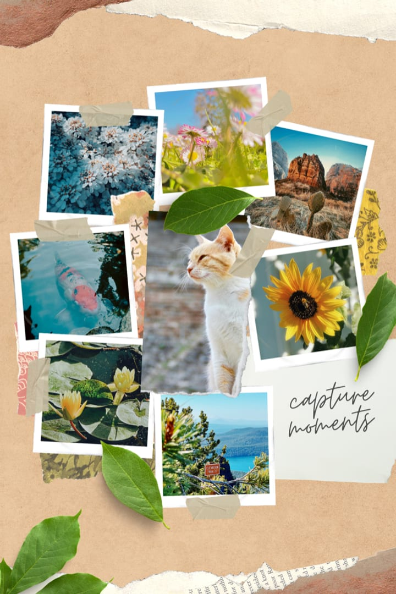
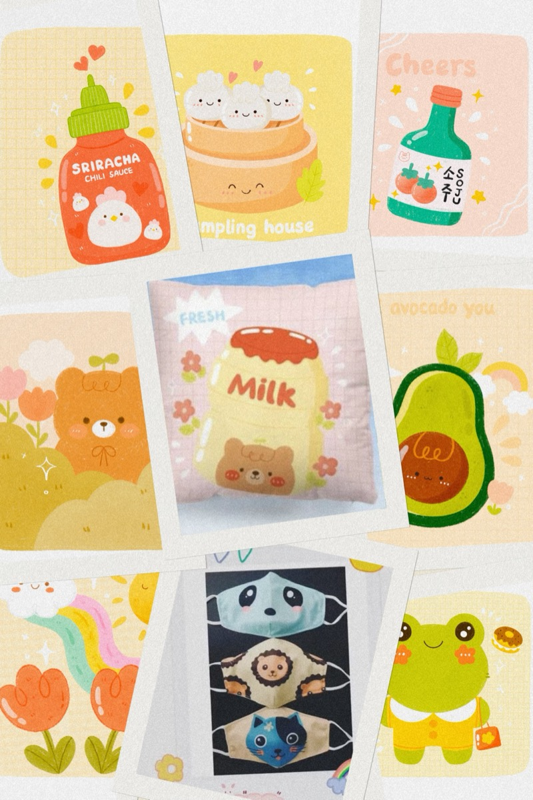
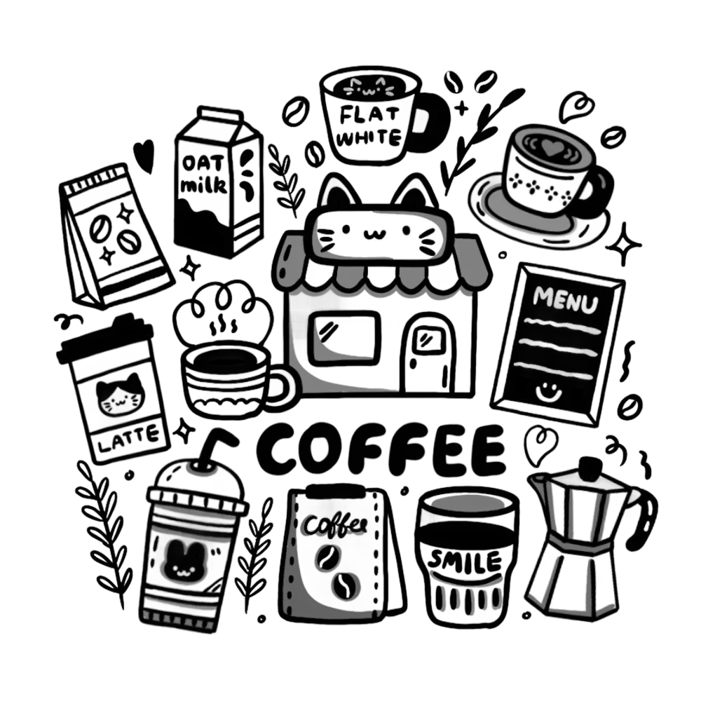

<!-- README stats use a public mirror — github-readme-stats.vercel.app often returns 503 for everyone -->
<!-- Snake SVGs are generated by `.github/workflows/snake.yml` (daily + manual dispatch) -->

<div align="center">



<br/>

<br/>

</div>

<table border="0" cellpadding="0" cellspacing="0" width="100%">
  <tr>
    <td width="32%" align="center" valign="middle">
      
      <br/><br/>
      <sub>✨ <b>Aanand Modi</b></sub>
    </td>
    <td width="68%" valign="top" style="padding-left: 20px;">
      <h2>📔 The Developer Logbook</h2>
      <p>I am a Computer Engineering student specializing in <b>AI/ML Orchestration</b> and <b>Agentic Workflows</b>. I build autonomous pipelines and tactile digital interfaces. I believe code should feel like craft.</p>
      <ul>
        <li>🎓 <b>B.E. AI & ML Student</b> @ Silver Oak University</li>
        <li>🏆 <b>2× National Hackathon</b> Podium Finisher</li>
        <li>📄 <b>Published Researcher</b> (ICEM / IJRISS 2026)</li>
      </ul>
      <blockquote>
        <b>Motto:</b> <i>"Ship it, then iterate."</i>
      </blockquote>
    </td>
  </tr>
</table>

<div align="center">
<br/>

<br/>
</div>

## 📼 Side A: Featured Tracks (Projects)

Here are the custom multi-agent architectures and full-stack solutions I have designed and deployed:

| Track | Build Name & Links | Blueprint & Tech Stack |
| :---: | :--- | :--- |
| **01** | **🤖 [HireMinds AI](https://lnkd.in/gPdR7Qwv)** | **Autonomous Hiring Orchestrator**<br/>6-agent autonomous pipeline orchestrating resume screening, live coding environments, adaptive MCQs, and AI voice interviews with explainable shortlisting.<br/>`Python` · `FastAPI` · `LangGraph` · `React` · `Docker` |
| **02** | **🚀 [StartupOps](#)** | **AI Co-Founder Advisory Engine**<br/>Autonomous co-founder advisor simulating a complete executive team to provide 24/7 strategic guidance, roadmap reviews, and pivot recommendations.<br/>`Python` · `LangGraph` · `React` · `TypeScript` · `Firebase` |
| **03** | **📄 [Magnetic Manuscript](https://github.com/aanandmodi/Magnetic-Manuscript)** | **AI Academic Manuscript Formatter**<br/>12-agent self-healing formatting pipeline parsing draft manuscripts to IEEE, Nature, and Lancet guidelines, auto-correcting compliance drops.<br/>`Python` · `LangGraph` · `Citeproc` · `Python-docx` · `FastAPI` |
| **04** | **🍎 [Food Insight Scanner](https://github.com/aanandmodi/food-insight-scanner)** | **Personalized Nutrition AI**<br/>Groq AI + OCR ingredient scanner parsing food barcodes/labels for allergen warnings, dietary compatibility, and health scoring.<br/>`Flutter` · `Dart` · `Groq AI` · `Google ML Kit` · `Firebase` |
| **05** | **✍️ [Bloggazers](https://github.com/aanandmodi/Bloggazers)** | **Full Stack Blog Platform**<br/>Feature-rich blog system with nested comments, CRUD operations, Google OAuth, and responsive Tailwind styling.<br/>`React` · `TypeScript` · `Node.js` · `Firebase` · `TailwindCSS` |
| **06** | **🛵 [WheelGo](https://github.com/aanandmodi)** | **Smart Mobility Platform**<br/>Real-time smart mobility locator connecting users with nearby wheel vendors with booking & navigation.<br/>`React Native` · `Node.js` · `MongoDB` |
| **07** | **🎪 [Ideathon Event Platform](https://github.com/aanandmodi)** | **Ideathon Portal UI**<br/>Interactive, highly animated multi-page event portal featuring dynamic countdown timers and polished micro-animations.<br/>`TypeScript` · `React` · `TailwindCSS` |

---

## 🎨 Sketches & Creative Moments

Here are some visual collage cards and hand-drawn doodles from my workbook:

<p align="center">
  
  &nbsp;&nbsp;
  
</p>

<div align="center">
<br/>

<br/>
</div>

## 🏆 Hackathon Campaigns

I thrive under pressure. Working in teams under tight deadlines is where the best ideas are born. Here's a brief look at my hackathon campaign logs:

*   🥉 **CodeVersity National Hackathon (IIT Gandhinagar, 48h)** — *2nd Runner-up (Apex Team)*
    *   *Built:* **HireMinds AI** — autonomous voice-interviewing proctoring engine.
*   🥉 **GDG Autonomous Hackathon 2026 (24h)** — *2nd Runner-up (Apex Team)*
    *   *Built:* **StartupOps** — multi-agent AI co-founder advisory simulator.
*   🏁 **HACKaMINeD 2026 (Nirma University)** — *Finalist (1250+ Hackers)*
    *   *Built:* **Magnetic Manuscript** — self-healing IEEE manuscript compiler.
*   🎯 **Avishkar 2.0 (Silver Oak)** — *Showcase Selection*
    *   *Built:* **Food Insight Scanner** — Flutter OCR allergen warning app.
*   ✅ **Smart India Hackathon (SIH 2025)** — *Internal College Top Qualifier*

---

## 📑 Research & Publications

*   **Paper Title:** *Navigating the Nutritional Maze: A Case for the Food Insight Scanner for Personalized Health*
*   **Journal:** International Journal of Research and Innovation in Social Science (**IJRISS**)
*   **Conference:** Presented at ICEM 2026 (NSB Bangalore)
*   **DOI Link:** [10.47772/IJRISS.2026.10190029](https://doi.org/10.47772/IJRISS.2026.10190029)

<details>
<summary>📖 <b>BibTeX Citation</b></summary>
<br/>

```bibtex
@article{modi2026nutrition,
  author    = {Aanand Modi and Abhishek Agarwal},
  title     = {Navigating the Nutritional Maze: A Case for the Food Insight Scanner for Personalized Health},
  journal   = {International Journal of Research and Innovation in Social Science (IJRISS)},
  year      = {2026},
  volume    = {10},
  issue     = {1},
  doi       = {10.47772/IJRISS.2026.10190029}
}
```
</details>

<div align="center">
<br/>

<br/>
</div>

## 🌱 Currently Learning & Exploring

<div align="center">

| Area | Topic | Status |
| :--- | :--- | :---: |
| 🤖 **AI/ML** | LLM Fine-tuning & Agentic Frameworks | 🔥 Active |
| ☁️ **Cloud** | AWS / GCP Fundamentals & Deployment | 📖 In Progress |
| ⚙️ **Backend** | Microservices, Message Queues (Kafka) | 📖 In Progress |
| 🧠 **CS Fundamentals** | Advanced DSA — Trees, Graphs, DP | 🔥 Active |
| 📱 **Mobile** | Flutter Advanced State Management | 🔥 Active |
| 🔐 **System Design** | Distributed Systems & Scalability | 🌱 Exploring |

</div>

---

## 🤝 Open to Collaborate On

- 🤖 **AI/ML Projects** — especially LLM-powered applications and intelligent agents
- 🌐 **Full-Stack Web Apps** — React + Node.js with real user value
- 📱 **Mobile Apps** — Flutter or React Native cross-platform builds
- 🏆 **Hackathons** — I love building fast with teams under pressure
- 📚 **Open Source** — contributing to projects that matter

<div align="center">
<br/>

<br/>
</div>

## 🛠️ The Toolkit

<div align="center">

[](https://skillicons.dev)

</div>

*   **Languages:** Python, Java, TypeScript, JavaScript, Dart
*   **AI & Agents:** LangGraph, LangChain, Groq AI, TensorFlow, Google ML Kit OCR
*   **Frontend & Apps:** React, Next.js, Tailwind CSS, Flutter, Dart
*   **Backend & Cloud:** FastAPI, Node.js, Firebase, MongoDB, PostgreSQL, Docker, GCP, AWS, Linux, Git

---

## 📊 GitHub Analytics

<p align="center">
  
  
</p>

<p align="center">
  
</p>

<details>
  <summary>📈 <b>View Detailed Analytics & Contributions</b></summary>
  <br/>
  
  <p align="center">
    <a href="https://github.com/ryo-ma/github-profile-trophy">
      
    </a>
  </p>
  
  <p align="center">
    
    
  </p>

  <p align="center">
    
  </p>
</details>

---

## 📬 Connect With Me

<div align="center">

[](https://linkedin.com/in/aanand-modi-648687353)
&nbsp;&nbsp;
[](mailto:aanandmodi09@gmail.com)
&nbsp;&nbsp;
[](https://www.instagram.com/_aanand16_/)
&nbsp;&nbsp;
[-000000?style=for-the-badge&logo=x&logoColor=white)](https://x.com/AanandModi7557)
&nbsp;&nbsp;
[](https://github.com/aanandmodi)

</div>

---

<div align="center">

### 💭 Dev Philosophy

*"The best code is not the most complex — it's the code that solves real problems for real people."*

<br/>

⚡ *Always building · always shipping · always learning.*

<br/>

<br/>

<p align="center">
  
  &nbsp;&nbsp;&nbsp;&nbsp;&nbsp;&nbsp;&nbsp;&nbsp;&nbsp;&nbsp;
  
  &nbsp;&nbsp;&nbsp;&nbsp;&nbsp;&nbsp;&nbsp;&nbsp;&nbsp;&nbsp;
  
  &nbsp;&nbsp;&nbsp;&nbsp;&nbsp;&nbsp;&nbsp;&nbsp;&nbsp;&nbsp;
  
</p>

<br/>

[](https://www.buymeacoffee.com/)

</div>


